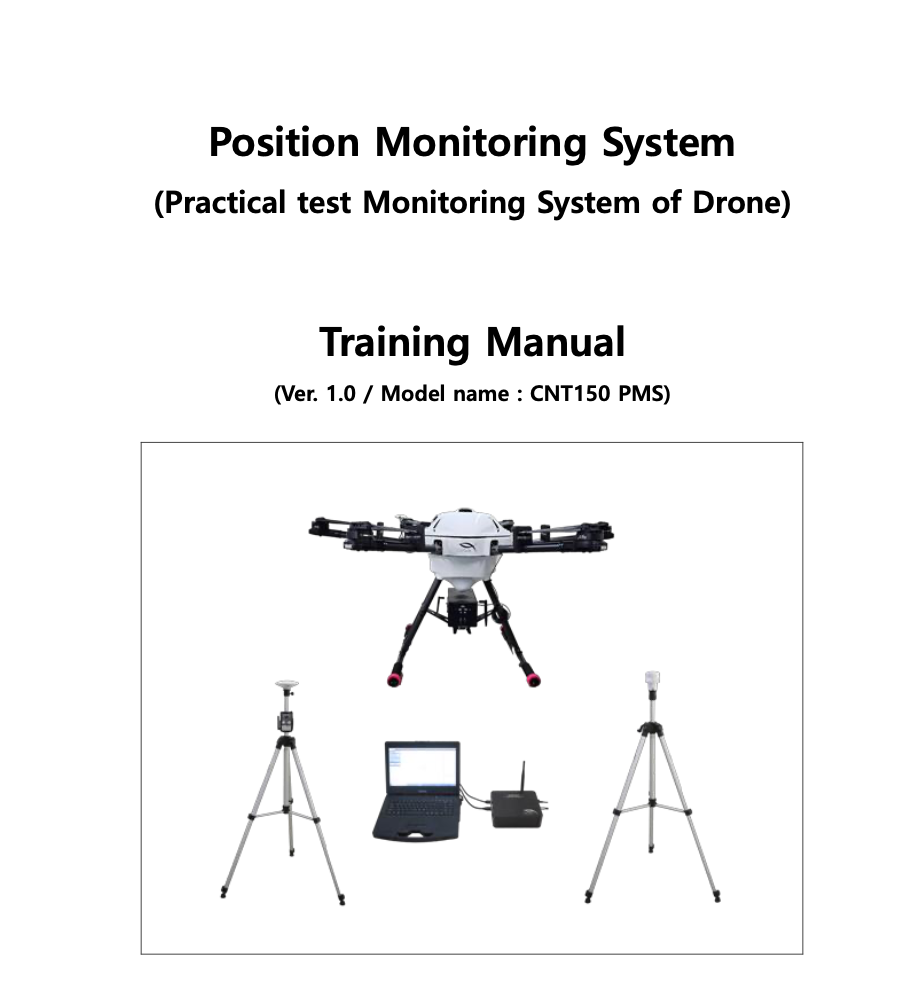

# Acknowledgement

This project is registered with the Korean Intellectual Property Office.  
This project belongs to [CNTech](https://icntech.co.kr/kor/main/main.html), and all software ownership rights are held by CNTech.  
Any sharing, redistribution, or derivative work based on this code is strictly prohibited.

# Abstract

This project automates the drone practical evaluation process to address disputes over fairness, which have arisen because assessments still rely heavily on the subjective judgment of human examiners.  
To measure the drone’s position with high precision, the system uses Real-Time Kinematic (RTK) technology.

Click the preview image to open the full PDF manual.